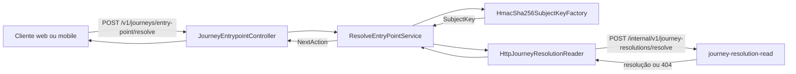

# Arquitetura do Journey BFF

## Objetivo

O `journey-bff` é a porta de entrada HTTP da jornada de abertura de conta. Sua responsabilidade é receber um CPF, transformá-lo em um identificador técnico não reversível (`SubjectKey`), consultar o serviço de leitura da jornada e informar ao cliente qual deve ser a próxima ação.

O BFF não persiste dados e não decide o estado da jornada por conta própria. Ele orquestra a validação do identificador, a proteção do CPF e a consulta ao `journey-resolution-read`.

## Visão geral



## Organização do código

A aplicação segue uma separação inspirada em arquitetura hexagonal:

| Camada | Pacote | Responsabilidade |
| --- | --- | --- |
| Entrada | `entrypoint.api` | Expõe a API HTTP, valida o contrato e converte comandos e respostas. |
| Aplicação | `application` | Orquestra o caso de uso de resolução do ponto de entrada. |
| Domínio da aplicação | `application.model` | Representa `SubjectKey`, `JourneyResolution` e as ações possíveis. |
| Portas de saída | `port.out` | Define contratos para gerar a chave e consultar a resolução. |
| Adaptadores de saída | `adapter.out` | Implementa HMAC-SHA256 e a integração HTTP com o read model. |
| Configuração | `config` | Mapeia as propriedades externas usadas pelos adaptadores. |
| Erros | `error` | Representa falhas conhecidas e independentes de HTTP. |

Essa divisão mantém o caso de uso desacoplado do protocolo HTTP e da implementação concreta do serviço consultado.

## Fluxo da requisição

1. O cliente envia `POST /v1/journeys/entry-point/resolve` com um identificador do tipo `CPF`.
2. O `JourneyEntrypointController` valida o corpo com Jakarta Validation e cria um `ResolveEntryPointCommand`.
3. O `ResolveEntryPointService` solicita ao `SubjectKeyFactory` a criação da chave técnica.
4. O `HmacSha256SubjectKeyFactory`:
   - remove caracteres não numéricos;
   - valida o tamanho, sequências repetidas e os dois dígitos verificadores do CPF;
   - calcula um HMAC-SHA256 usando o segredo configurado;
   - codifica o resultado em Base64 URL-safe, sem padding.
5. O CPF não é enviado ao read model. O `HttpJourneyResolutionReader` envia somente a `SubjectKey` para `POST /internal/v1/journey-resolutions/resolve`.
6. Quando o read model responde com sucesso, o BFF devolve a `nextAction` encontrada.
7. Quando o read model responde `404`, não existe uma jornada conhecida e o caso de uso devolve `NEW_ONBOARDING_ALLOWED`.
8. Falhas de comunicação ou respostas inesperadas do read model são traduzidas para `503 Service Unavailable`.

## Contrato externo

Exemplo de requisição:

```json
{
  "identifier": {
    "type": "CPF",
    "value": "529.982.247-25"
  }
}
```

Exemplo de resposta:

```json
{
  "nextAction": "NEW_ONBOARDING_ALLOWED"
}
```

As ações previstas pelo contrato são:

- `AUTHENTICATION_REQUIRED`: existe uma relação que exige autenticação;
- `ONBOARDING_RESUME_REQUIRED`: há uma abertura de conta em andamento;
- `NEW_ONBOARDING_ALLOWED`: não existe jornada anterior e uma nova pode começar;
- `ONBOARDING_UNAVAIABLE`: a abertura não está disponível para a chave identificadora enviada.

## Tratamento de erros

O `JourneyApiExceptionHandler` centraliza a conversão de exceções para o formato `ProblemDetail`:

| Situação | HTTP | Código |
| --- | --- | --- |
| CPF inválido | `400 Bad Request` | `INVALID_CPF` |
| Read model indisponível ou resposta inesperada | `503 Service Unavailable` | `JOURNEY_RESOLUTION_UNAVAIBLE` |

Erros de formato e validação do corpo também são tratados pelo mecanismo padrão do Spring WebFlux.

## Configuração e execução

| Variável de ambiente | Obrigatória | Padrão | Uso |
| --- | --- | --- | --- |
| `JOURNEY_READ_BASE_URL` | Não | `http://journey-resolution-read:8080` | Endereço do serviço de leitura. |
| `JOURNEY_SUBJECT_KEY_SECRET` | Sim | Nenhum | Segredo usado no HMAC-SHA256. |

A aplicação escuta a porta `8080`. O Actuator expõe `health` e `info`. O `application.yaml` também permite o endpoint `prometheus`, mas ele só fica disponível quando um registry Prometheus é incluído nas dependências.

O container usa duas etapas:

1. Maven com JDK 21 compila e empacota o jar executável do Spring Boot.
2. Uma imagem com JRE 21 executa somente o artefato final com usuário não privilegiado (`10001`).

Exemplo de execução local:

```bash
docker build -t journey-bff .
docker run --rm \
  -p 8080:8080 \
  -e JOURNEY_SUBJECT_KEY_SECRET='substitua-por-um-segredo-forte' \
  -e JOURNEY_READ_BASE_URL='http://host.docker.internal:8081' \
  journey-bff
```

## Decisões e limites

- O HMAC permite correlacionar o mesmo CPF sem trafegar ou armazenar o documento em texto claro. O segredo deve vir de um gerenciador de segredos e não deve ser incluído na imagem.
- O BFF é stateless; múltiplas instâncias podem ser executadas em paralelo.
- O read model é uma dependência síncrona do endpoint. Sua indisponibilidade impede uma resolução segura e resulta em `503`.
- A ausência de uma resolução (`404`) é um resultado de negócio, não uma falha técnica.
- Timeout, retry e circuit breaker ainda não estão configurados explicitamente; devem ser considerados antes de produção para limitar o impacto de lentidão no serviço de leitura.
