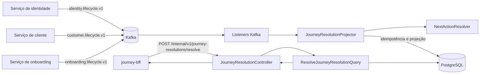

# Arquitetura do Journey Resolution Read

## Objetivo

O `journey-resolution-read` é o modelo de leitura da jornada de abertura de conta. Ele consolida, por `subjectKey`, os estados publicados pelos contextos de identidade, cliente e onboarding e calcula a próxima ação que os canais devem apresentar ao usuário.

O serviço não recebe nem armazena o CPF. A correlação acontece pela `subjectKey`, uma chave técnica gerada pelo `journey-bff`. O BFF consulta este serviço por HTTP e transforma a resolução interna em uma decisão para o cliente web ou mobile.

## Estilo arquitetural

A implementação combina três ideias principais:

- **arquitetura hexagonal:** entradas HTTP e Kafka ficam separadas da aplicação por componentes e portas;
- **CQRS no lado de leitura:** eventos de outros serviços alimentam uma projeção otimizada para consulta;
- **processamento idempotente e ordenado por versão:** eventos repetidos ou mais antigos não alteram a visão consolidada.

O serviço possui dois fluxos independentes que compartilham a mesma projeção:

1. um fluxo assíncrono de escrita, iniciado por eventos Kafka;
2. um fluxo síncrono de leitura, iniciado por uma requisição HTTP.



## Organização do código

| Área | Pacote | Responsabilidade |
| --- | --- | --- |
| Entradas HTTP | `entrypoint.api` | Expõe a consulta interna e converte DTOs de requisição e resposta. |
| Entradas Kafka | `entrypoint.messaging.consumers` | Consome os tópicos de ciclo de vida e encaminha eventos ao projetor. |
| Leitura de eventos | `entrypoint.messaging.integration` | Desserializa JSON e converte payload inválido em uma exceção da aplicação. |
| Aplicação de projeção | `application.projection` | Controla idempotência, ordenação, atualização da projeção e cálculo da próxima ação. |
| Aplicação de consulta | `application.query` | Busca uma projeção e retorna somente os dados necessários à API. |
| Modelo | `model` | Representa estados, próxima ação e a projeção consolidada. |
| Portas de saída | `port.out` | Define os contratos de persistência sem expor JDBC à aplicação. |
| Adaptadores PostgreSQL | `adapter.out.postgres` | Implementa as portas com `NamedParameterJdbcTemplate`. |
| Eventos de integração | `integrationevent` | Define os contratos recebidos dos serviços produtores. |
| Configuração | `config` | Configura relógio UTC e política de repetição do consumidor Kafka. |

As dependências apontam das entradas e dos adaptadores para a aplicação e o modelo. O `JourneyResolutionProjector` depende das interfaces de repositório, enquanto as classes JDBC fornecem as implementações concretas por injeção do Spring.

## Modelo de dados e estados

### Projeção `journey_resolution`

Existe uma linha por `subjectKey`. Ela contém:

- o estado e a versão mais recente de identidade;
- o estado e a versão mais recente de cliente;
- o estado e a versão mais recente de onboarding;
- a `nextAction` calculada;
- uma versão própria da projeção;
- a data da última resolução.

Quando chega o primeiro evento de uma chave, a intenção do repositório é criar a projeção com os valores iniciais abaixo:

| Campo | Valor inicial |
| --- | --- |
| Identidade | `UNKNOWN`, versão `0` |
| Cliente | `UNKNOWN`, versão `0` |
| Onboarding | `NONE`, versão `0` |
| Próxima ação | `NEW_ONBOARDING_ALLOWED` |
| Versão da projeção | `0` |

A versão de cada fonte evolui de forma independente. A `projectionVersion` é incrementada uma vez para cada evento novo efetivamente aplicado, mesmo que o resultado de `nextAction` permaneça igual.

### Registro `processed_event`

A tabela registra o `eventId` e os metadados do evento processado. A chave primária em `event_id`, combinada com `ON CONFLICT DO NOTHING`, implementa a deduplicação necessária para a entrega pelo menos uma vez do Kafka.

Os metadados esperados em todos os eventos são:

| Campo | Finalidade |
| --- | --- |
| `eventId` | Identidade global do evento e chave de idempotência. |
| `eventType` | Tipo lógico do evento. |
| `aggregateId` | Agregado que originou a mudança. |
| `subjectVersion` | Versão usada para ordenar eventos da mesma fonte. |
| `occurredAt` | Momento em que o evento ocorreu. |
| `correlationId` | Correlação distribuída da operação. |
| `producer` | Serviço produtor. |
| `schemaVersion` | Versão do contrato do evento. |

O corpo acrescenta `subjectKey` e o novo `status` correspondente ao tipo do evento.

## Fluxo de atualização da projeção

Os tópicos configurados são:

| Origem | Tópico | Evento |
| --- | --- | --- |
| Identidade | `identity.lifecycle.v1` | `IdentityStatusChangedEvent` |
| Cliente | `customer.lifecycle.v1` | `CustomerStatusChangedEvent` |
| Onboarding | `onboarding.lifecycle.v1` | `OnboardingStatusChangedEvent` |

O processamento pretendido de cada mensagem é:

1. O listener recebe o valor da mensagem como `String`.
2. O `IntegrationEventJsonReader` desserializa o JSON para o record do evento correspondente.
3. O listener chama uma das sobrecargas de `JourneyResolutionProjector.project`.
4. O projetor inicia uma transação e obtém o horário atual por um `Clock` em UTC.
5. `ProcessedEventRepository.tryRegister` tenta inserir o `eventId` em `processed_event`.
6. Se o evento já estiver registrado, o processamento termina sem alterar a projeção.
7. O repositório cria a projeção, caso ainda não exista, e executa `SELECT ... FOR UPDATE` para serializar atualizações concorrentes da mesma `subjectKey`.
8. A `subjectVersion` é comparada com a versão já aplicada para a fonte do evento. Uma versão menor ou igual é considerada obsoleta e não altera a projeção.
9. O estado e a versão da fonte são substituídos pelos valores do evento.
10. `NextActionResolver` recalcula a decisão usando os três estados consolidados.
11. A projeção recebe uma nova `projectionVersion`, o instante de atualização e é persistida.
12. Com o commit, tanto o registro de idempotência quanto a atualização da projeção tornam-se visíveis. Se ocorrer uma falha, ambos são revertidos e o Kafka pode entregar a mensagem novamente.

O `DefaultErrorHandler` espera um segundo entre as tentativas e está configurado com tentativas ilimitadas. Como o consumidor usa `enable-auto-commit: false` e `ack-mode: record`, o offset só avança após o processamento bem-sucedido do registro.

Para preservar ordenação também no Kafka, os produtores devem publicar eventos referentes à mesma pessoa usando a `subjectKey` como chave da mensagem. Essa exigência é arquitetural; não pode ser garantida pelo código deste consumidor.

## Regra de resolução da próxima ação

O `NextActionResolver` aplica regras em ordem de precedência. A primeira condição satisfeita encerra a avaliação:

| Prioridade | Condição | Resultado |
| --- | --- | --- |
| 1 | Onboarding `IN_PROGRESS` | `ONBOARDING_RESUME_REQUIRED` |
| 2 | Onboarding `COMPLETED` | `AUTHENTICATION_REQUIRED` |
| 3 | Identidade `ACTIVE` ou `SUSPENDED` | `AUTHENTICATION_REQUIRED` |
| 4 | Cliente `ACTIVE` ou `SUSPENDED` | `AUTHENTICATION_REQUIRED` |
| 5 | Nenhuma condição anterior | `NEW_ONBOARDING_ALLOWED` |

Consequências importantes dessa precedência:

- um onboarding em andamento deve ser retomado mesmo que identidade ou cliente já indiquem uma relação existente;
- onboarding concluído sempre exige autenticação;
- identidade `DISABLED`, cliente `CLOSED` e onboarding `REJECTED` ou `EXPIRED`, isoladamente, caem na regra padrão e permitem um novo onboarding;
- `ONBOARDING_UNAVAILABLE` existe no enum, mas não é produzido por nenhuma regra atual.

## Fluxo de consulta HTTP

O endpoint interno é:

```http
POST /internal/v1/journey-resolutions/resolve
Content-Type: application/json
```

Requisição:

```json
{
  "subjectKey": "chave-tecnica-da-pessoa"
}
```

O campo é obrigatório e não pode ser vazio. O fluxo é:

1. `JourneyResolutionController` valida a requisição.
2. `ResolveJourneyResolutionQuery` consulta `JourneyResolutionProjectionRepository` pela `subjectKey`.
3. Se a projeção existir, a API responde `200 OK` com a decisão atual.
4. Se não existir, a API responde `404 Not Found` sem corpo.

Exemplo de resposta bem-sucedida:

```json
{
  "nextAction": "ONBOARDING_RESUME_REQUIRED",
  "projectionVersion": 4,
  "updateAt": "2026-07-18T18:30:00Z"
}
```

O `404` significa ausência de estado conhecido, não indisponibilidade técnica. No desenho da jornada completa, o `journey-bff` interpreta essa ausência como permissão para iniciar um novo onboarding.

## Configuração e execução

O projeto usa Java 21, Spring Boot 4.1, Spring MVC, Spring Kafka, Spring JDBC, Flyway e PostgreSQL.

| Variável | Valor padrão | Uso |
| --- | --- | --- |
| `DATABASE_URL` | `jdbc:postgresql://localhost:5432/journey_resolution` | Conexão JDBC. |
| `DATABASE_USERNAME` | `journey` | Usuário do banco. |
| `DATABASE_PASSWORD` | `journey` | Senha do banco. |
| `KAFKA_BOOTSTRAP_SERVERS` | `localhost:9092` | Brokers Kafka. |

Outras definições relevantes:

- porta HTTP: `8081`;
- consumer group: `journey-resolution-read-v1`;
- início do consumo sem offset: `earliest`;
- migrações Flyway: habilitadas na inicialização;
- relógio da aplicação: UTC;
- endpoints de gerenciamento declarados: `health` e `info`.

O `Dockerfile` usa build em duas etapas: Maven/JDK 21 para gerar o jar e JRE 21 para executá-lo como usuário não privilegiado `10001`.

## Consistência, concorrência e falhas

- A API oferece **consistência eventual**: uma mudança só aparece na consulta depois que o evento correspondente for consumido e confirmado.
- A deduplicação por `eventId` protege contra reentregas da mesma mensagem.
- As versões independentes protegem contra eventos atrasados de uma mesma fonte.
- O bloqueio pessimista por `subjectKey` evita que atualizações concorrentes sobrescrevam umas às outras no PostgreSQL.
- O registro do evento e a alteração da projeção participam da mesma transação local.
- Não existe transação distribuída entre Kafka e PostgreSQL. Uma falha após o commit no banco e antes da confirmação do offset provoca reentrega, absorvida pela idempotência.
- Eventos inválidos e outras falhas são repetidos indefinidamente. Sem uma dead-letter topic, uma mensagem irrecuperável pode bloquear o avanço da partição.

## Pontos de atenção no estado atual do código

A arquitetura acima representa a intenção observada nas classes, mas há inconsistências que impedem ou comprometem o funcionamento completo da implementação atual:

1. **Listener de cliente não registrado:** `CustomerStatusChangedListener` não possui `@Component`; por isso, não é descoberto pelo component scan e o tópico de cliente não é consumido por essa classe.
2. **Migração e repositório usam nomes diferentes:** a migração cria `update_at` e `occured_at`, enquanto os repositórios usam principalmente `updated_at` e `occurred_at`. O mapper também tenta ler `update_at` após consultas que selecionam `updated_at`.
3. **Parâmetros incorretos ao criar a projeção:** `lockOrCreate` registra parâmetros com os nomes derivados do valor de `subjectKey` e `update_at`, mas o SQL espera `subjectKey` e `updatedAt`.
4. **Tipos temporais da migração:** o script usa `TIMESTAMPZ`; no PostgreSQL, o tipo esperado para instante com fuso é `TIMESTAMPTZ` ou `TIMESTAMP WITH TIME ZONE`.
5. **Imagem Docker não encontra o artefato:** o estágio final tenta copiar `journey-bff-*.jar`, mas este módulo gera `journey-resolution-read-*.jar`.
6. **Contrato de porta entre serviços:** este serviço escuta `8081`, enquanto a configuração padrão atualmente documentada no `journey-bff` aponta para `journey-resolution-read:8080`.
7. **Gerenciamento sem dependência:** `health` e `info` estão configurados, mas o `pom.xml` não inclui o starter Actuator que fornece esses endpoints.
8. **Cobertura automatizada ausente:** não há testes em `src/test`; a compilação passa, mas os fluxos JDBC, Kafka, regras e contrato HTTP não estão protegidos por testes automatizados.

Esses itens devem ser corrigidos antes de considerar o serviço pronto para execução integrada ou produção.
